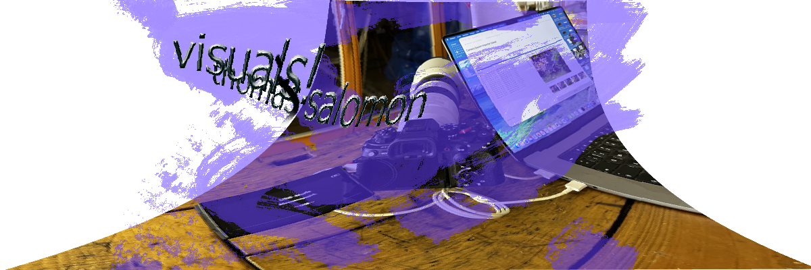
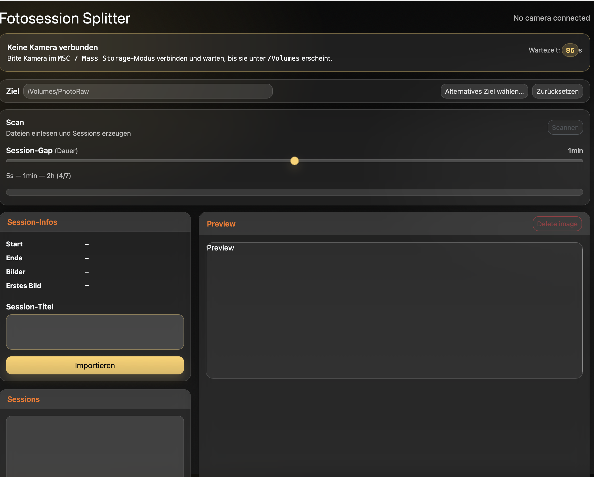

#  fotostudio-helper

<p align="center"><em>(MacOS, Linux, Windows)</em></p>
<p align="center">
  

</p>

Cool for photographers NAS-Workflow. 

Kennst Du das: *Kameras und Handys in der Familie, Geräte, die bei verschiedenen Cloudanbietern speichern.* **Alles irgendwie da, aber zerissen** - alles ist irgendwo.

Ziele: 
- **Alle Bilder aller Kameras / Handys** sollen in einer einheitlichen Ordnerstruktur unter logischen Sessionnamen" abgelegt werden.
- Kein Struktur-Import in Bildverarbeitungsprogramme, stattdessen sollen Programme die existierende Struktur nutzen.


## Features 




- Session-Erkennung anhand Zeit-Gaps
- Web-GUI im Browser
- Preview für alle Sessions
- Manuelles benennen der Fotosessions
- Import in frei definierbare Zielordner (z. B. NAS)

## Next Steps / Future

-  Fotosession - Aufteilung Dynamisch / Interaktiv
-  Delete-Button
-  Update von Sony Custom Settings
  
## Voraussetzungen
- Node.js >= 18
- macOS oder Linux


Installation
```bash
git clone <repo-url>
cd studio-helper
npm install
```
