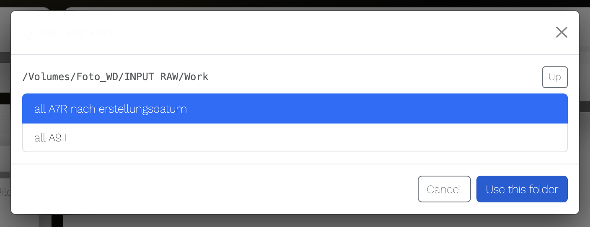
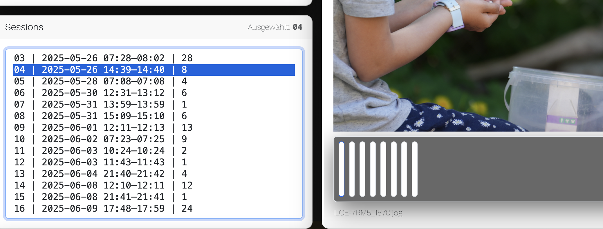
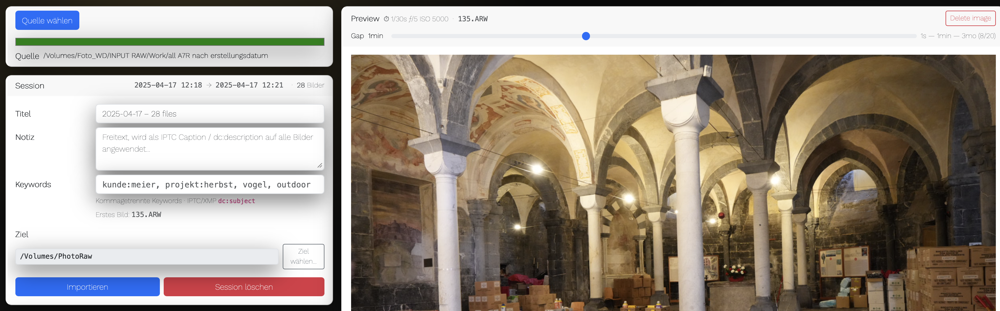

# Fotosession - basierter Bildarchiv - Workflow

*Photosessions zukunftssicher speichern und zur Weiterverarbeitung vorbereiten.*

**fotostudio-helper** ist ein zukunftssicheres Bildarchiv als Basis für weitere Prozesse. Die App skaliert auf >10000 Sessions monatlich, ist schnell, praxisbezogener als mir bekannte Systeme, welche oft Ordnerstrukturen wie YYYY//MM/DD nutzen. 

"Legacy" - Archive (z.b. Lightroom/ON1, etc.. sind kompatibel und können die Session-Struktur nutzen.

<p align="center">
  
</p>

- No matter how you switch photo devices: your work is captured. Safe.
- Industriestandard. Nichts wird gelöscht, nichts wird überschreiben. 
- Ergebnis: Single Source of Truth - Dein Langzeitarchiv.

## Zielgruppe:

- 😎 Fotografen, große und kleine Studios
- Agenturen und Broadcast-Produktionen

## Anwendung und Einsatzgebiete

<details>
<summary>Anwendung und Einsatzgebiete</summary>


- **Privat**: Du willst Deine Bilder besser sortieren.
- **Familie**: Du hast *Kameras und Handys*, die Bilder bei *verschiedenen Cloudanbietern* speichern. Bau damit ein Familienarchiv, wo jeder beitragen kann. 
- **Dein Office**: Ordner mit Bildern von *irgendwem* und *über igendwas und sonstwas* wollen einsortiert werden.
- **Dein Studio**: Die Mitarbeiter fotografieren mehrere Events gleichzeitig im selben Zeitraum, ihre Handyshots "Behind the Stage" sind auch mega und Deine Drohnen filmen sonstwo ... **"The usual chaos"**.

Meine Idee ist der Monat, in dem fotografierte Sessions optimal strukturiert landen. Du willst nicht alles importieren, sondern Selektionen erzeugen.


</details>

## Features

<details>
<summary>Unterstützte Dateitypen, Sessionbildung und Langzeit - Archivierung</summary>

### Unterstützte Dateitypen
- RAW:
  - `.arw`, `.cr2`, `.cr3`, `.nef`, `.raf`, `.dng`, `.rw2`, `.orf`, `.pef`, `.srw`
- Raster:
  - `.jpg`, `.jpeg`, `.tif`, `.tiff`


- Bilder aus beliebigen Quellen werden automatisch in stabile, sessionbasierte Ordnerstrukturen organisiert.
- JPEGs und Sidecars (XMP, ON1, …) der RAW-Dateien werden kompatibel mit Lightroom, Capture One, Photoshop und Bilddatenbanken in einen Sessionordner verschoben.

### Live-Session-Shaping
- Sessions werden live und datengetrieben anhand realer Aufnahmeabstände erkannt, interaktiv angepasst und mit Metadaten angereichert. Sie entstehen initial anhand eines Zeit-Gaps(Default: neue Session nach 30 Minuten ohne Aufnahme)
- Der Gap-Slider passt die Sessiongrenzen in Echtzeit an
und die neuen Cluster (andere Bildanzahlen) werden in der Sessionliste sichtbar.
- Vorab-Auswahl problematischer oder irrelevanter Bilder direkt im Scan, Sessions können am Stück gelöscht, benannt, beschrieben und verschlagwortet werden
- Jede Session erhält eine session.json mit allen Metadaten
- Gelöschte Bilder werden quellseitig in einen Papierkorb verschoben

### Session - Archivierung

Jede Fotosession ist ein Moment. Er kann kann länger oder kürzer sein, das 10/stel der Sekunde oder Wochenlang - das regelst du mit dem slider und teilst so Deine Bilder ein.
Er kann auch von mehreren Kameras kommen (Ein weiterer Filter dafür neben dem Zeit -  Gap kommt vielleicht noch.)

- Skalierbare Langzeitarchivierung, **Software-agnostisch:** keine Bindung an ein bestimmtes Bildbearbeitungs- oder Asset-Management-System  
- Einheitliche, stabile Ordnerstruktur als langfristige "Quelle der Wahrheit"

- Bilder aus beliebigen Quellen werden automatisch zu logischen Fotosessions gruppiert.
Grundlage ist der tatsächliche Aufnahmezeitpunkt – nicht Ordnernamen oder Geräte.
  - Alle Bilder landen in einer konsistenten, nachvollziehbaren Struktur
  - Sessions erhalten sprechende, stabile Namen (Default: <Target>/<YYYY>/<MM>/<YYYY-MM-DD Titel__KAMERANAME>)
  - Sind mehrere Kameras beteiligt, wird der Sessionordner-Suffix zu __MIXED
  - Quelle (UI) und Ziel (Config) sind unabhängig konfigurierbar.


```
└── 📁2025
    └── 📁04
        └── 📁2025-04-17 Genua Hauptgang am Hafen__SONY ILCE-7RM5
            └── 📁exports
                └── 📁jpg
                └── 📁jpg-klein
                └── 📁tif
            └── 📁originals
                ├── SONY ILCE-7RM5__0890.arw
                ├── SONY ILCE-7RM5__0890.on1
                ├── SONY ILCE-7RM5__0890.xmp
                ├── SONY ILCE-7RM5__0891.arw
                ├── SONY ILCE-7RM5__0891.on1
                ├── SONY ILCE-7RM5__0891.xmp
                ├── SONY ILCE-7RM5__0892.arw
                ├── SONY ILCE-7RM5__0892.on1
                ├── SONY ILCE-7RM5__0892.xmp
            └──  session.json
```
Basis des exportierten Session-Ordnernamens ist der Zeitstempel des ersten Bildes der Session, gefolgt von der Kamera.  

Darin nach dem Export session.json mit weiterverwendbaren  Meta - Daten über den gespeicherten Session - Zeitraum .


</details>


## Screenshots

1. Quelle Wählen.




2. Berechnete Sessions prüfen und anpassen:



3. ... der Gap - Schieberegler passt den Zeitversatz an Deinen Fotomoment an. (Das ist der blaue Punkt 🔵 oben über der Vorschau.)


4. Gewählte Session oder Teile daraus löschen, beschreiben und exportieren.



## Changelog

<details>
<summary>Current Version 2.0.0</summary>


### ADDED.
- Folder selection modal for instant source scan ("looking for photosessions"). Now, instead of a mounted camera volume, any source is selectable.
- Complete sessions can be deleted (Super hilfreich, wenn man mit dem Slider eine Reihe "kaputter" Bilder gefunden hat)

### FIXED.
- Session gap calculation
- Exposure reading

### CHANGED.
- session folder names get __mixed suffix if they contain mixed cameras.
- files suffix for the camera is created based on exif or "unknown".
- Instead of assuming a source folder has no subdirectories, the app will now search for main files (raw formats or jpg) in the source (recursive). Then every folder inside the source is scanned for corresponding companion files. So no matter how messed the folder is, the app will put together what belongs together. This means: If there are compagnion files near the raw, process them to the session folder. If the compagnion file is a jpg, put it to /sessionname/exports/jpg


### REMOVED.
- Camera constraints, Camera polling

</details>

<details>
<summary>Upcoming Version 2.0.1</summary>

### PLANNED.

- Session UUID forever - immutable fingerprint
- better (more human-thinking-like) session shaping

<details>

## Implementierung


<details>
<summary>Voraussetzungen & Setup</summary>

**Voraussetzungen**
- Node.js ≥ 18  
- Aktuelle Version von exiftool  
- Getestet unter macOS (automatische Erkennung der Standard-User-Verzeichnisse)  
  – eine saubere Portierung nach Linux ist gut möglich und vorgesehen; der aktuelle Stand funktioniert in der Regel bereits.

**Installation**


```bash
# if not installed (MAC)
brew install node
brew install exiftool

git clone https://github.com/codegarden13/fotostudio-helper
cd fotostudio-helper
npm install
```
Alternativ: ZIP herunterladen, auspacken 

**Start**

```bash
cd /App 
node start server.js
```
... der erste Start dauert (einmalig) länger, da Komponenten nachgeladen werden. 
