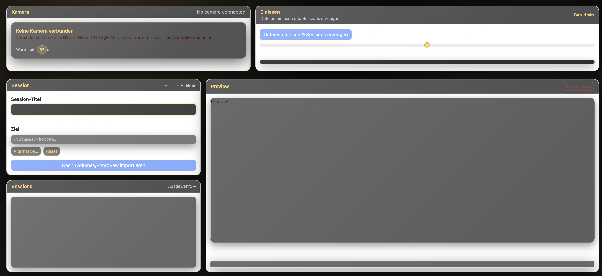

#  fotostudio-helper (MacOS, Linux)
*Solid Photo Storage workflow app (Audience: Fotografen, Studios, Privatanwender)*

Du kennst das: Einige *Kameras und Handys, die Bilder bei verschiedenen Cloudanbietern speichern.* 

**Alles irgendwie da, aber zu verteilt** - alles ist irgendwo. 
Das kann man zentralisieren ... 

<p align="center">
  

</p>

<p align="center">No matter how you switch photo devices: Your sessions are captured.</p>

## Features

### Skalierbare Langzeitarchivierung
- **Software-agnostisch:** keine Bindung an ein bestimmtes Bildbearbeitungs- oder Asset-Management-System  
- Einheitliche, stabile Ordnerstruktur als langfristige "Quelle der Wahrheit"

### Präsentation von Fotosessions beim Kunden
- Interaktives Session-Shaping in Echtzeit
- Datengetriebener Zeit-Gap-Slider: reale Aufnahmeabstände bestimmen die Clusterung

### Einheitliche Ordnerstruktur für alle Kameras & Handys
- Bilder aller Geräte landen in **einer konsistenten Struktur**
- Logische Sessionnamen (Default: `<Target>/<YYYY>/<MM>/<YYYY-MM-DD Titel>`)
- Ziel-Volume und Root in der GUI änderbar

### Fotosession-Import
- Sessions werden werden nach den Scan **interaktiv** definiert und optional benannt
- Sessionnamen werden im Zielarchiv als Ordner sichtbar
- Sessionbilder werden auf der Kamera in einen Papierkorb-Ordner gelegt
- Der Prozess wird in ein Logfile geschrieben
Es entsteht so eine Struktur im Ziel. 
Basis des Ordnernamens ist der Datestamp des ersten Bildes der Session.

<details>

```
└── 📁2025
    └── 📁08
        └── 📁2025-08-24 Kamele
            └── 📁exports
            └── 📁originals
                ├── DSC09281.ARW
                ├── DSC09283.ARW
                ├── DSC09285.ARW
            ├── .import.log
        └── 📁2025-08-24 Kamele Endauswahl
            └── 📁exports
            └── 📁originals
                ├── DSC09271.ARW
                ├── DSC09273.ARW
                ├── DSC09275.ARW
                ├── DSC09277.ARW
                ├── DSC09279.ARW
            ├── .DS_Store
            ├── .import.log
        └── .DS_Store
```

</details>

### Erweiterbarkeit auf Deine Datenträger

<details>

- Jeder **gemountete Datenträger** kann als Quelle dienen (Kamera, NAS, USB-Stick, ein Pfad auf Deinem Rechner.) 
- Die Konfiguration ist **Geräte- und workflow-spezifisch**
- Zusätzliche (Kamera) -Profile können selbst ergänzt (oder als Dienstleistung umgesetzt) werden  
 
- Aktueller Schwerpunkt: **Sony / Canon Kameras**

</details>

## Benutzeroberfläche, UI, Workflow

<details>

### Kamera verbinden
Warten auf Kamera


### Scannen


### Fotosessions justieren und wählen 
### Fotosession optional umbenennen 

### sichern / exportieren 

</details>

## Upcoming Features, Issues

<details>

### Todos
- Ordnername mit Camerakenner prefixen

### Upcoming / Maybe

- Farbpalette aus Bildserien/Sessions ableiten (HEX / RGB / HSL)
- Import aus *Iphone* und *Canon-Kameras* (, was gemounted ist - USB-Sticks, Iphones, Kameras.
- Interaktiver Metrik - Graph per Session
- Update von Sony Custom Settings 

</details>

## Installation

<details>


- Node.js >= 18

Installation

```bash
git clone https://github.com/codegarden13/fotostudio-helper
cd studio-helper
npm install
```

</details>

Bei Bedarf: 

Sende mir *gerne* einen Serviceauftrag zur Implementierung in Deinem Studio mit Deinen Kameras 😊 - oder eine Tasse Kaffee !